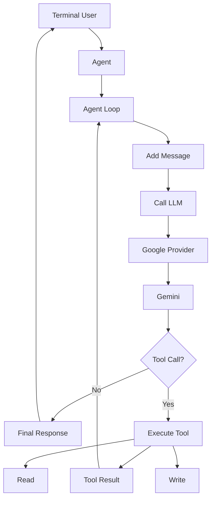

### High-Level Architecture

```mermaid
flowchart TD
    U[Terminal User] --> A[Agent]
    A --> L[Agent Loop]
    L --> S[Add Message]
    S --> C[Call LLM]
    C --> G[Google Provider]
    G --> M[Gemini]
    M --> D{Tool Call?}
    D -->|No| F[Final Response]
    D -->|Yes| T[Execute Tool]
    T --> R[Tool Result]
    R --> L
    F --> U
    T --> RT[Read]
    T --> WT[Write]
```