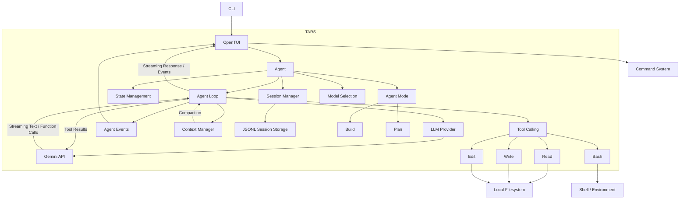

# TARS

TARS is a terminal-based AI coding agent built with TypeScript and Node.js. It uses the Gemini API to understand tasks, inspect codebases, modify files, execute commands, and verify changes through an interactive terminal UI powered by OpenTUI.

## Installation — No Setup Required

TARS standalone binaries include the Bun runtime — you do **not** need to install Bun, Node.js, npm, Git, or clone the repository.

### macOS / Linux

```bash
curl -fsSL https://raw.githubusercontent.com/vansh-vm04/tars/main/install.sh | sh
```

### Windows (PowerShell)

```powershell
irm https://raw.githubusercontent.com/vansh-vm04/tars/main/install.ps1 | iex
```

Then run:

```bash
tars
```

Re-run the same command anytime to update to the latest release.

**Supported platforms**

| Platform | Binary | Installer |
|---|---|---|
| macOS Apple Silicon | `tars-darwin-arm64` | `install.sh` |
| macOS Intel | `tars-darwin-x64` | `install.sh` |
| Linux x64 | `tars-linux-x64` | `install.sh` |
| Linux ARM64 | `tars-linux-arm64` | `install.sh` |
| Windows x64 | `tars-windows-x64.exe` | `install.ps1` |

Installs to `~/.local/bin/tars` (macOS/Linux) or `%LOCALAPPDATA%\tars\tars.exe` (Windows) and ensures the directory is on your `PATH`. No `sudo` required.

**Alternative — npm** (requires Node.js, not required for standalone):

```bash
npm i -g tars
# or
npx tars
```

> **Note:** Standalone binaries are built with `bun build --compile` and already contain the Bun runtime. Verified with OpenTUI 0.5.6 — native Zig core is bundled. Cross-compilation via `bun --target` is used in CI (single `ubuntu-latest` runner builds all 5 targets without needing a local macOS/Linux machine).

## Tech Stack

* TypeScript
* Node.js
* Gemini API
* OpenTUI
* JSONL
* Tool Calling
* Streaming Responses
* Markdown Rendering

## High-Level Architecture



## Agent Loop

The Agent Loop is the core execution runtime of TARS.

```text
User Prompt
    ↓
Agent
    ↓
Context
    ↓
Gemini API
    ↓
Text / Tool Calls
    ↓
Tool Execution
    ↓
Tool Results
    ↓
Context
    ↓
Gemini API
    ↓
Final Response
```

The loop continues until the LLM returns a final response without additional tool calls.

Multiple independent tool calls can be returned by the model and executed in a batch.

Tool results are fed back into the conversation so the model can inspect results, recover from failures, and continue working.

## Context Management & Compaction

TARS currently operates with a `200k` token context window.

The Context Manager is responsible for keeping long-running agent sessions within the available context window.

* Monitors context usage.
* Triggers compaction before the context becomes full.
* Preserves recent conversation context.
* Condenses older conversation history.
* Allows the Agent Loop to continue after compaction.
* Bounds large tool results before they enter the context.

The `read` tool also supports incremental retrieval using `offset` and `limit`, preventing unnecessarily large file contents from entering the context.

This allows TARS to maintain longer coding sessions without continuously accumulating the full conversation history.

## Tool Calling

TARS currently provides four core tools:

| Tool    | Purpose                                    |
| ------- | ------------------------------------------ |
| `read`  | Read files with `offset` / `limit` support |
| `write` | Create or overwrite files                  |
| `edit`  | Make precise text-based file changes       |
| `bash`  | Execute shell commands and inspect output  |

Tool execution is controlled by the application rather than relying only on LLM instructions.

Tool errors are returned to the LLM as structured tool results, allowing it to understand failures and recover when possible.

The `bash` tool also applies safety checks to prevent unauthorized or dangerous operations.

## Session Management & Persistence

Each conversation belongs to an active session.

The Session Manager handles:

* Session creation
* Session loading
* Conversation persistence
* Message history
* Session state
* Session restoration

Sessions are persisted as JSONL, providing a simple line-oriented representation of conversation history and state.

This allows users to leave TARS and later resume previous coding sessions.

## Agent Modes

TARS supports two agent modes:

| Mode    | Purpose                                                                        |
| ------- | ------------------------------------------------------------------------------ |
| `build` | Implement changes, modify files, execute commands, and verify results          |
| `plan`  | Inspect the codebase and produce an implementation plan without making changes |

The active mode determines:

* System prompt
* Available tools
* Tool permissions
* Agent behavior

Mode changes are controlled by the TARS command system. The LLM itself cannot change the active agent mode.

```text
/agent plan
    ↓
Read-only planning

/agent build
    ↓
Implementation + verification
```

## Streaming Responses

TARS streams LLM responses directly into the terminal instead of waiting for the complete response.

```text
Gemini
   ↓
Streaming Response
   ↓
Agent Loop
   ↓
Agent Events
   ↓
OpenTUI
   ↓
Terminal
```

This provides immediate feedback during long-running generations and tool execution.

## Agent Events

TARS uses an event-driven architecture to communicate runtime activity from the Agent Loop to the TUI.

Agent events represent activities such as:

* Agent execution state
* Streaming response updates
* Tool execution start
* Tool execution completion
* Tool results
* Errors
* Agent completion

The TUI consumes these events to display live execution state without directly controlling the Agent.

## State Management

TARS keeps agent/application state separate from the terminal UI.

Agent state includes:

* Current model
* Current agent mode
* Active session
* Conversation context
* Execution state

The Agent owns its runtime state, while the TUI renders that state.

Commands provide the interface for changing application-level state rather than allowing UI components to directly manipulate the Agent.

## Model Selection

TARS supports switching between available LLM models through the command system.

Model selection and agent mode are intentionally separate:

```text
/model  → Which model should TARS use?

/agent  → How should TARS operate?
          build / plan
```

## Terminal UI

TARS uses OpenTUI to provide an interactive terminal interface.

The TUI handles:

* User input
* Command interaction
* Model selection
* Agent mode selection
* Session selection
* Streaming response rendering
* Markdown rendering
* Agent status
* Tool activity
* Live execution feedback

The UI communicates with the runtime through commands and agent events instead of directly controlling agent behavior.

## Markdown Rendering

LLM responses are rendered as Markdown inside the terminal UI.

This supports readable terminal output for:

* Headings
* Lists
* Code blocks
* Inline code
* Structured responses

## Command System

TARS provides a small command system for application-level operations.

| Command     | Purpose                           |
| ----------- | --------------------------------- |
| `/model`    | Select the active model           |
| `/agent`    | Switch between `build` and `plan` |
| `/new`      | Start a new session               |
| `/sessions` | Browse and resume sessions        |
| `/exit`     | Exit TARS                         |

Commands are handled by the application rather than being interpreted as ordinary LLM instructions.

## Project Structure

```text
src/
├── agent-events/
├── commands/
├── compaction/
├── providers/
├── storage/
├── tools/
├── tui/
├── utils/
│
├── agent.ts
├── agent-loop.ts
├── context-manager.ts
├── llm.ts
├── modes.ts
├── session-manager.ts
└── types.ts
```

The architecture keeps the major responsibilities separated:

* `agent.ts` — Agent state and runtime behavior
* `agent-loop.ts` — LLM/tool execution loop
* `agent-events/` — Runtime event system
* `tools/` — Environment interaction
* `providers/` — LLM provider abstraction
* `context-manager.ts` — Context tracking and compaction
* `session-manager.ts` — Session lifecycle
* `storage/` — JSONL persistence
* `commands/` — Application commands
* `tui/` — Terminal interface
* `modes.ts` — Build/Plan mode configuration

## Status

TARS has reached a feature-complete milestone for its current scope.

The core runtime and terminal experience are implemented, including:

* LLM provider abstraction
* Gemini integration
* Streaming responses
* Tool calling and execution
* Tool safety
* Agent events
* Context management
* Automatic compaction
* Session persistence with JSONL
* State management
* Model selection
* Build/Plan agent modes
* Command system
* OpenTUI terminal interface
* Markdown rendering
* Live agent/tool activity

The project is now considered complete for its current milestone. Future development will be occasional and focused on additional features, improvements, and refinements.
