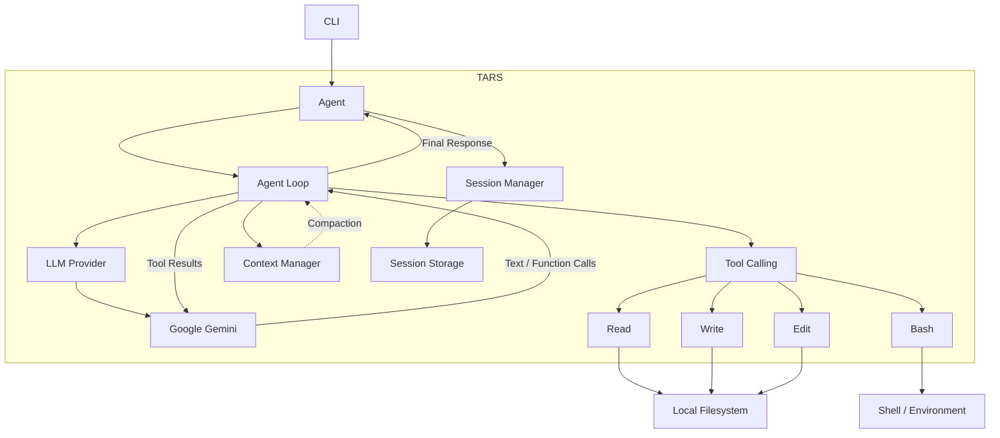

# TARS

TARS is a terminal-based AI coding agent that uses LLMs to understand tasks, inspect codebases, modify files, run commands, and verify changes.

## High Level Architecture

## How It Works

1. The CLI receives a user prompt.
2. The Agent manages the active session and conversation context.
3. The Agent Loop sends the current context to the LLM.
4. The LLM returns text and/or function calls.
5. Multiple independent tool calls can be returned and executed in a batch.
6. Tool results are added back to the conversation and the loop continues.
7. Context Manager monitors the context window and triggers compaction when required.
8. The Agent continues until the LLM returns a final response with no tool calls.

## Tool Calling

TARS currently provides four core tools:

| Tool    | Purpose                                    |
| ------- | ------------------------------------------ |
| `read`  | Read files with `offset` / `limit` support |
| `write` | Create or overwrite files                  |
| `edit`  | Make precise text-based file changes       |
| `bash`  | Execute shell commands and inspect output  |

Tool errors are returned to the LLM as structured tool results, allowing it to understand failures and recover when possible.

## Context Management

TARS currently operates with a `200k` token context window.

The Context Manager:

* Monitors context usage.
* Triggers compaction before the context becomes full.
* Preserves recent conversation context.
* Condenses older conversation history.
* Allows the agent loop to continue after compaction.

Large tool results are bounded before entering the context. The `read` tool supports incremental retrieval using `offset` and `limit`.

## Session Management

Each user prompt belongs to an active session.

The Session Manager handles:

* Session creation and loading
* Conversation persistence
* Message history
* Session state across interactions

## Status

TARS is actively under development.

The current focus is building a reliable, modular terminal-agent runtime with robust tool calling, context management, compaction, session persistence, and provider abstraction.
